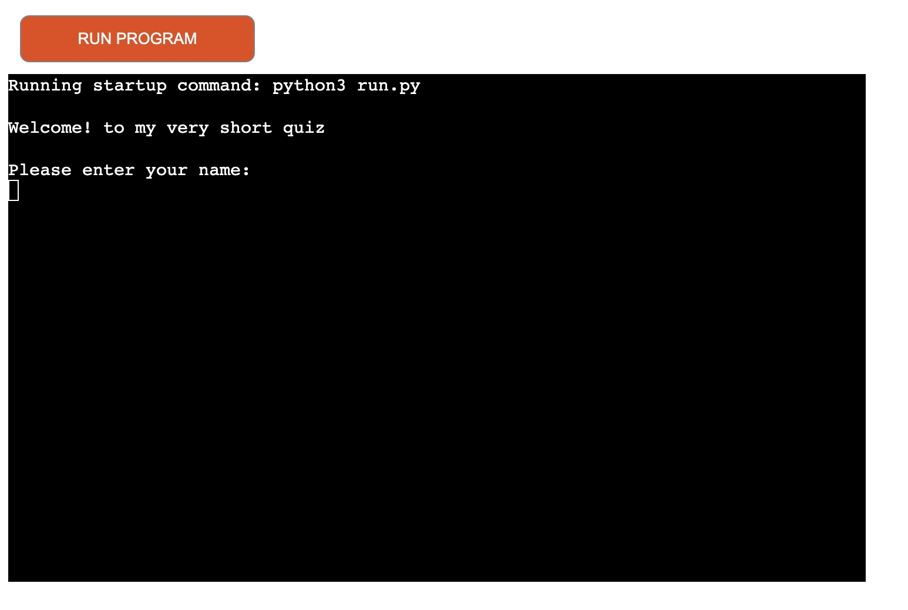
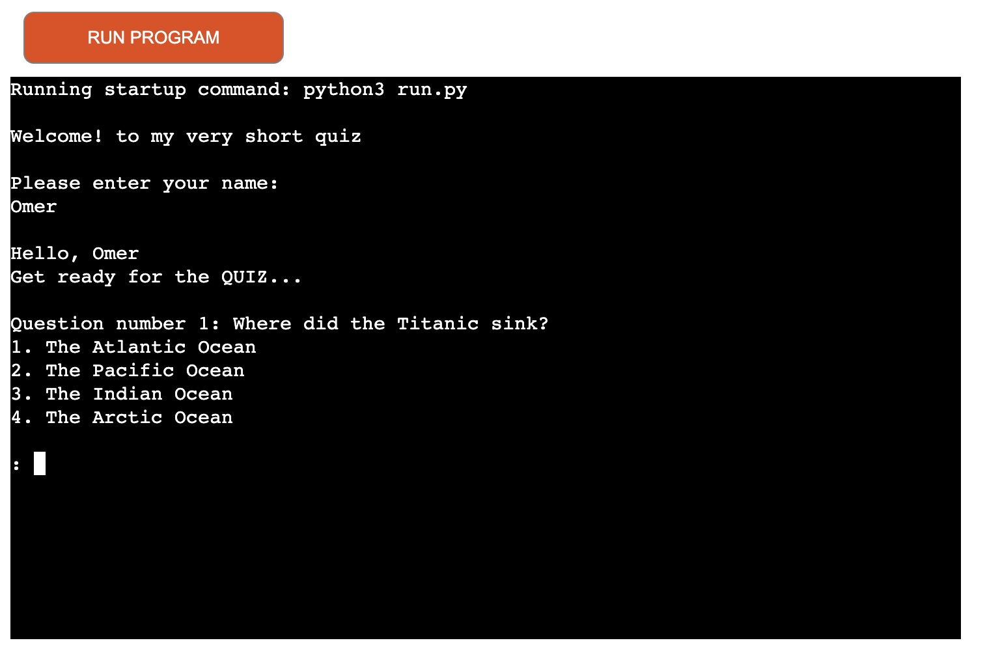
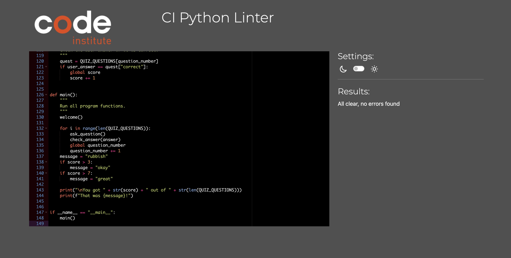

# Smart-Quiz

Smart-Quiz is a Python terminal simple quiz program, which runs in a mock terminal on Heroku.

All what the user need is to enter his name to see a nice hello message from the program and then answer the quiz questions by choosing between the four differnet choices the quiz provides.

Live version: https://smart-quiz-43016e3a9f93.herokuapp.com/

## User Experience - UX

### Strategy

I wanted this quiz to be as simple as possible, so I made the program simply asks the user for his name to give him a hello message and then directly printing the quiz questions. 
at the end the user can see his score and funny feedback about his answers.

> The project has no prospective client, it is built purely for fun, engagement and learning purposes

#### User Stories
- I want to be able to read the messages clearly
- I want to be able to make a choice from the displayed answers
- I want to see some interresting questions
- I want to be able to know my score
- I want to be able to repeat the quiz again to test other answers

#### User Goals
- Engage with a simple terminal program that is fun and easy to operate

#### Site Owner Goals
- Create an easy to operate, and interactive terminal program
- Add challenging quiz for the user
- Add a simple welcoming method to engage the user

### Structure

The flowchart for the Smart-Quiz is as below:

## User Interface - Surface

As the program ment to be simple as I said, so the User Interface was very similar to any trminal type program, taking inputs and displaying some messages and so on.

### Welcome 
The first message the user see when he opens the program is a simple welcoming message and an input area asking for his name.

### Questions
Questions is displayed with choices beneath them.

### The Score
The score is displayed with a funny feedback after it.

## Testing

Tested and validated by the [CI Python Linter](https://pep8ci.herokuapp.com/)

## Technologies Used

### Languages

- [Python](https://www.python.org/) - Main language for the terminal program

### Other Softwares

- [Draw.io](https://app.diagrams.net/) - Used to create flowchart for the Quiz
- [Gitpod](https://www.gitpod.io/#get-started) - Used to code the project and save to online repo
- [Github](https://github.com/) - For version control
- [Code Institute Python Linter](https://pep8ci.herokuapp.com/) - For python code validation
- [Heroku](https://id.heroku.com/login) - For terminal deployment

## Deployment

This project was deployed using Code Institute's mock terminal for Heroku.

### Heroku 

- Create an account on Heroku.
- Navigate to Heroku Dashboard and "Create a New App".
- Input App name and choose a region you are closer to.
- Select "Settings" from the table, and search for "Buildpack"
- Add "python" and "nodejs" from the list, in that order.
- Go to Deploy section, connect to GitHub.
- Search for the repository name to connect.
- Click on Deploy Branch or enable Automatic Deploy.
- Allow a few minutes and view the deployed program.

## Credits

### Content

- [Stack Overflow](https://stackoverflow.com/questions/52335970/how-to-fix-syntaxwarning-invalid-escape-sequence-in-python) - For correcting invalid excape sequence warning
- [Typing Hints](https://docs.python.org/3/library/typing.html) - For python typing hints
- [BrewStation Project By Henna Singh](https://github.com/hennasingh/BrewStation) - For inspiration for the README.md file

### Media
- [Geeks for Geeks](https://www.geeksforgeeks.org/python-program-to-print-emojis/) - Unicodes to print emojis
- [PythonGPT](https://openai.com/chatgpt/) - For Coffee animation code

## Acknowledgements
- [Code Institute](https://codeinstitute.net/) for Python essentials and Love Sandwiches project
- Spencer Barriball  - For his guidance and review on the project
- Code Institute Slack Community - For feedback, reviews and community support.